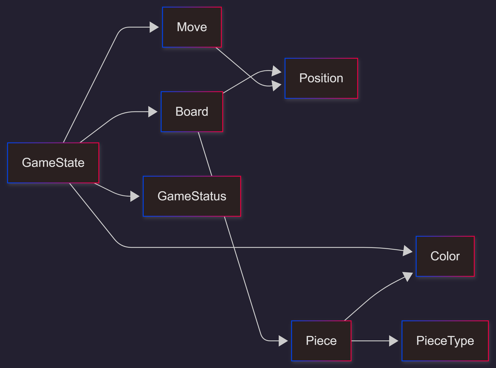
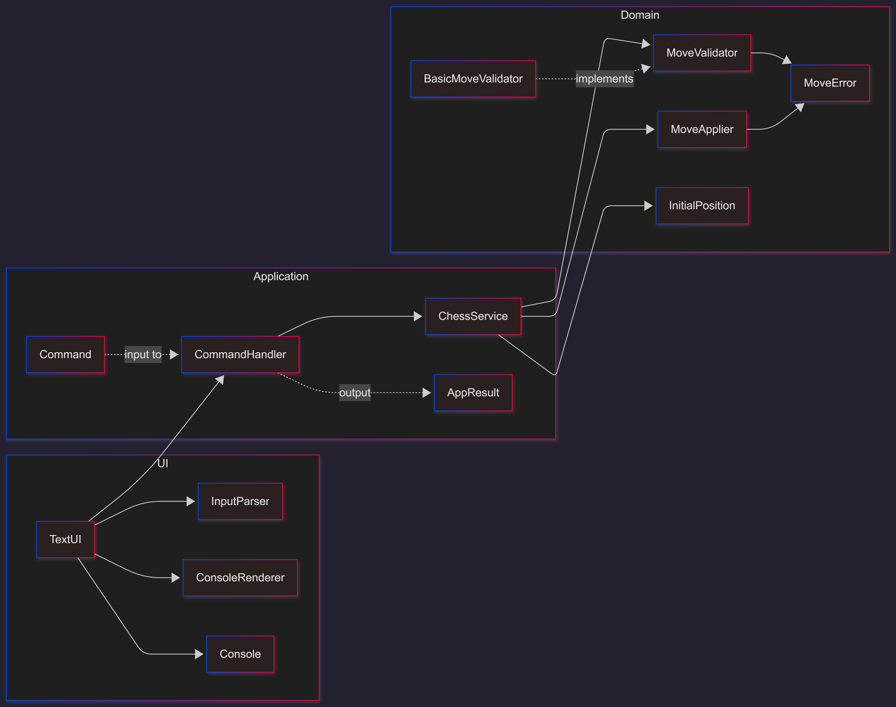

## SeArChess — Scala 3 Chess Engine

[](https://coveralls.io/github/arutepsu/SeArChess?branch=main)

A pure functional chess engine implemented in Scala 3, built as a university software architecture project.

### Usage

```bash
sbt run          # start the text UI
sbt compile      # compile
sbt test         # run tests
sbt report       # tests + coverage report
sbt ci           # tests + coverage + Coveralls upload
```

---

## Domain Model



---

## Architecture


