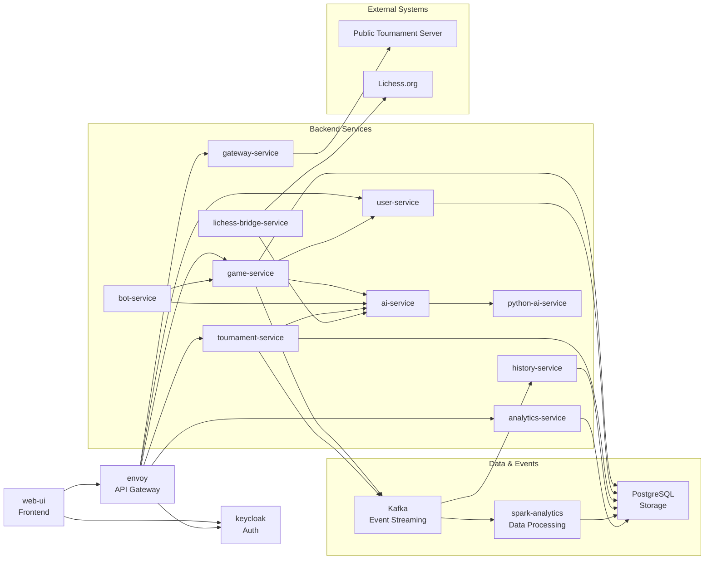

# Searchess Architecture

## Overview

Searchess is a chess platform that started as a layered modular monolith and evolved into a hybrid
service-based architecture. It is not a pure microservice system — services share a Postgres
instance, some runtime concerns are co-located in containers, and the deployment is currently
single-node. The more accurate description is a **hybrid architecture**: a reusable chess core
library plus multiple independently deployable services, event/data processing infrastructure, and
external integrations.

---

## High-Level Architecture

The system is structured around several concerns:

- **Web UI** — React/TypeScript single-page app; the only browser-facing component
- **Envoy** — API gateway and edge entry point; all browser traffic passes through it
- **Keycloak** — Authentication and token issuance (JWT/OIDC); services validate tokens
- **Backend services** — Scala 3 (http4s / ZIO / Cats Effect) services for games, users, history,
  tournaments, bots, AI, analytics, external integration; Python service for the neural-network AI
- **Kafka** — Event streaming layer for game events, tournament lifecycle events, and live analytics
- **PostgreSQL** — Main persistent storage; used by game, user, history, tournament, and analytics
  services, and written to directly by Spark analytics jobs
- **Spark** — Analytics processing; runs as a subprocess (batch) inside the tournament-service
  container and as a long-running Structured Streaming pod (live game events)
- **External systems** — A public tournament server (separate deployment) and Lichess.org

---

## Deployable Components

| Component | Category | Responsibility |
|---|---|---|
| `searchess-web-ui` | Frontend | React/TypeScript SPA; game UI, bot tournaments, analytics dashboards |
| Envoy | Gateway / Edge | Reverse proxy; routes API calls, enforces JWT auth, proxies Keycloak flows |
| `searchess-keycloak` | Auth | OAuth2/OIDC token issuance; custom searchess login theme baked into the image |
| `searchess-game-service` | Backend | Game session lifecycle, move validation, WebSocket push; produces Kafka game events |
| `searchess-user-service` | Backend | User profiles, Lichess account linking, Keycloak sub mapping |
| `searchess-history-service` | Backend | Persists completed game records consumed from Kafka |
| `searchess-analytics-service` | Backend | Read-only REST layer over Spark-computed analytics tables in Postgres |
| `searchess-tournament-service` | Backend | Bot tournament orchestration; spawns Spark batch analytics as a subprocess |
| `searchess-gateway-service` | Backend | Proxy to the public tournament server; shields the browser from cross-origin calls |
| `searchess-bot-service` | Backend | Worker service that polls for pending bot turns, requests moves from ai-service, and submits them to game-service |
| `searchess-ai-service` | Backend | Scala AI service; evaluates positions using heuristics or delegates to python-ai-service |
| `searchess-python-ai-service` | Backend | Python/PyTorch neural network trained on Lichess games; returns move suggestions |
| `searchess-lichess-bridge-service` | Backend | Connects a bot account to Lichess; accepts challenges, delegates moves to ai-service |
| `searchess-spark-analytics` | Data processing | Spark Structured Streaming pod; ingests live game events from Kafka → Postgres |
| Kafka | Event streaming | Decouples game-service, history-service, and spark-analytics; carries game and tournament events |
| PostgreSQL | Storage | Shared persistent storage for all stateful backend services and Spark analytics output |
| MongoDB | Storage (alt) | Alternative persistence backend for game history; selected by configuration |
| Redis | Storage | In-cluster Redis StatefulSet; used where configured as an alternative stream or session infrastructure |

---

## Architecture Diagram

---

## Main Runtime Flows

**Web UI request:** Browser → Envoy → target backend service. Envoy validates the JWT on protected
routes (via the Keycloak JWKS endpoint) before forwarding. WebSocket connections (live game) also
pass through Envoy.

**Authentication:** Browser redirects to Keycloak for login. Keycloak issues a JWT. The browser
includes it as a Bearer token. Envoy and individual services validate the token signature
independently.

**Game flow:** game-service manages sessions and validates moves against the core chess engine. It
calls user-service to resolve player identities and notifies history-service and analytics via Kafka
events on game completion.

**AI move flow:** game-service (or bot-service) calls ai-service with the board position.
ai-service evaluates the position with its heuristic engine or delegates to python-ai-service
(HTTP) for a neural-network prediction.

**Bot/tournament flow:** tournament-service schedules and runs bot-vs-bot tournaments using
bot-service for player orchestration and ai-service for move generation. Game events are written
to a JSONL file per tournament job.

**Analytics flow:** after a bot tournament completes, an explicit `POST /api/tournaments/{id}/analyze`
call triggers the Spark batch job as a subprocess inside the tournament-service container. Spark
reads the JSONL file, computes 13 analytics tables, and writes results to PostgreSQL. analytics-service
exposes the results via REST; the web-ui `AnalyticsPage` displays them. Separately, a long-running
Spark Structured Streaming pod (`spark-analytics`) consumes `searchess.game.events.v1` from Kafka
and writes live game results to `public.live_game_results`.

**Public tournament integration:** gateway-service proxies browser calls to the public tournament
server's export API. The tournament-service also exposes an import endpoint that fetches a public
tournament export and converts it to the same JSONL format used by local bot tournaments, allowing
the same Spark analytics pipeline to be applied.

---

## Persistence

Backend services follow repository / DAO abstractions — the persistence backend is selected
through configuration at startup, not hardcoded in domain or service logic.

- **PostgreSQL** — primary backend for all stateful services in the current deployment
- **MongoDB** — alternative persistence backend for game history; `mongo:4.4` is pinned because
  the university server's VM does not have AVX CPU instructions required by newer releases
- **Redis** — used for session state and caching
- Spark analytics tables are written directly via JDBC by the Spark batch job (not through service
  repository layers)

---

## Analytics

1. **Local bot tournament analytics**  
   Bot games produce JSONL event files (`GameStarted`, `MovePlayed`, `GameFinished` per game).  
   On explicit trigger, tournament-service spawns the packaged Spark binary as a subprocess.  
   Spark reads the JSONL, computes leaderboard, Elo ratings, head-to-head, termination reasons,
   color performance, strategy comparisons, and 7 further tables, then writes all to PostgreSQL.  
   analytics-service reads results; the web-ui `AnalyticsPage` renders them.

2. **Public tournament analytics (import path)**  
   The tournament-service fetches a finished public tournament's export JSON and converts it to
   the same JSONL format. The same Spark batch job then processes it identically.  
   Engine-specific metrics (Stockfish comparison) are unavailable because the public export
   does not carry engine type information.

3. **Live game event streaming**  
   A dedicated Spark Structured Streaming pod consumes the `searchess.game.events.v1` Kafka topic
   (human-vs-AI games) and writes completed game records to `public.live_game_results`.  
   analytics-service exposes these at `/api/analytics/live/game-results`.

---

## Deployment

The production deployment targets a single-node university server running **k3d** (k3s-in-Docker),
which provides a full Kubernetes API locally within Docker. The same manifest set would work on a
real multi-node Kubernetes cluster with minor changes (swap k3d's built-in LoadBalancer for a real
provider, remove k3d-specific cluster scripts).

- **Kubernetes manifests** live in `deployment/k8s/` using a Kustomize base + overlays layout
- **GitOps** — ArgoCD watches the repository and auto-syncs on any change to the overlay
  kustomization file (`selfHeal: true`, `prune: false`)
- **CI/CD** — GitHub Actions (`build-images.yml`) builds Docker images on relevant path changes,
  tags them `sha-<7-char-git-sha>`, pushes to GHCR, and updates image tags in the kustomization
  file; ArgoCD detects the change and rolls out
- **Canary releases** — `python-ai-service` uses Argo Rollouts with a canary strategy in the
  production overlay
- **Secrets** — managed with Bitnami Sealed Secrets; plain-text secrets are removed by patch in
  the production overlay
- **Stateful components** — PostgreSQL, Kafka, MongoDB, Redis run in-cluster; their data is stored
  on the k3d node's local filesystem (no cloud-managed volumes)
- **Spark checkpoints** — the spark-analytics pod uses a 1 Gi PVC for Structured Streaming
  checkpoint state

---

## Notes / Limitations

- **Hybrid architecture, not pure microservices.** Services share a Postgres instance, and the Spark
  batch job runs as a subprocess inside the tournament-service container rather than as an isolated
  cluster job.
- **Tournament analytics output has no persistent volume.** JSONL event files and Spark CSV output
  are stored inside the tournament-service container at `/data/tournament-jobs`. Data is lost on pod
  restart; a PVC at that path would be needed for durability.
- **Public tournament display bypasses Spark.** The `PublicTournamentAnalyticsPage` fetches analytics
  directly from the external tournament server's own export endpoint (via gateway-service), not from
  the Spark-computed tables in analytics-service.
- **Single-node deployment.** The current university deployment is a single k3d node. Spark runs
  with `local[*]` (no cluster); the Structured Streaming pod cannot scale beyond one replica due to
  filesystem-bound checkpoint state.
- **ELO computation is not distributed.** `EloAnalytics` calls Spark's `collect()` to materialize
  all game results in driver memory before computing ratings sequentially. This is correct but does
  not scale to very large tournament datasets.
