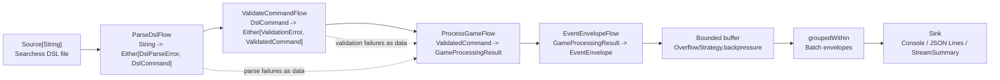
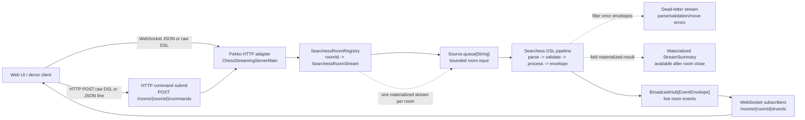

# Reactive Streams Assignment Architecture

The `apps/chess-streaming` module contains the university assignment pipeline for Searchess-specific reactive streams. It is intentionally local to the assignment module and does not change the production `EventPublisher` implementation or the domain model.

## Pipeline

```text
Source[String]
  -> ParseDslFlow
  -> ValidateCommandFlow
  -> ProcessGameFlow
  -> EventEnvelopeFlow
  -> Batch/Backpressure Flow
  -> Sink
```



## Source: Searchess DSL file

The stream starts from a Searchess DSL file. The default demo input is `apps/chess-streaming/src/main/resources/searchess-game.dsl`, and the command-line runner can also accept a file path from `args`.

Each line is emitted as one `String` element. Empty lines and comment lines beginning with `#` are intentionally handled by the parser flow, so the source stays simple and only owns file reading.

## Flow 1: ParseDslFlow

`ParseDslFlow` turns raw text lines into streaming-local `DslCommand` values:

- `session <sessionId>`
- `players <whiteName> <blackName>`
- `move <playerName> <uciMove>`
- `status`
- `resign <playerName>`

Malformed input is represented as `DslParseError` data with the line number and raw input. Parse errors do not fail the stream by default, which lets the sink summarize both successful commands and rejected input.

## Flow 2: ValidateCommandFlow

`ValidateCommandFlow` checks stream-level command ordering and syntax assumptions before game processing:

- a session must be declared first
- players must be declared after the session
- moves, status, and resign commands require registered players
- a player cannot resign before players are known

Validation failures become `ValidationFailed` results. They continue through the stream as data so the assignment pipeline can report them at the sink.

## Flow 3: ProcessGameFlow

`ProcessGameFlow` owns assignment-local orchestration state:

- current session id
- registered white and black player names
- current domain `GameState`
- finished flag after resignation, checkmate, or draw

Move processing delegates chess legality to the existing domain `GameStateRules` boundary. This keeps rules in the domain layer and keeps Pekko-specific flow types out of the domain.

## Flow 4: EventEnvelopeFlow

`EventEnvelopeFlow` wraps each processing result into an `EventEnvelope`. The envelope shape is Kafka-ready: it contains an event id, event type, session id, sequence number, timestamp, and payload text. It is still only an in-memory assignment representation.

## Batch and backpressure flow

The batching flow groups envelopes before they reach the sink. This demonstrates a concrete backpressure boundary: downstream sinks receive bounded batches rather than an unbounded event firehose.

## Sink

The assignment runner provides console output and a summary sink. The sink prints each batch and collects a `StreamSummary` containing total events, accepted moves, rejected moves, parse failures, validation failures, and finished games.

## Pekko room demonstration

`SearchessRoomStream` adds a live room/session demonstration on top of the same assignment pipeline. A room is one materialized stream with its own parser state, validation state, game-processing state, event-envelope sequence, and bounded input queue.

```text
Source.queue[String]
  -> ParseDslFlow
  -> ValidateCommandFlow
  -> ProcessGameFlow
  -> EventEnvelopeFlow
  -> Backpressure Flow
  -> BroadcastHub[EventEnvelope]
```



Commands are submitted as raw Searchess DSL lines. Current subscribers receive live `EventEnvelope` values from the room's `BroadcastHub`, and consumers that need assignment-style batches can use the room's batched event source.

`SearchessRoomRegistry` manages rooms by `roomId`. It intentionally stays inside `apps/chess-streaming`; it does not change production `EventPublisher`, does not persist room state, and does not introduce a custom Publisher/Subscriber framework.

## Error, summary, and demo strategy extensions

The room stream has a small assignment-local `RoomStreamSettings` model:

- `recoverNonFatal`: keep non-fatal stream errors as recovered error envelopes.
- `failFast`: fail the stream on fatal event envelopes instead of recovering.
- `throttlePerElement`: slow down room output for demos.

Dead-letter handling is modeled as a filtered stream of error envelopes rather than as exceptions:

- `ParseFailed`
- `ValidationFailed`
- `MoveRejected`
- `StreamRecovered`

This demonstrates a common reactive-streams pattern: malformed or rejected input can continue as data through a separate observable channel while valid game events keep flowing.

Each room also materializes a `StreamSummary`. The summary is completed when the room input queue is closed and can then be stored by `SearchessRoomRegistry`.

## HTTP/WebSocket adapter

`ChessStreamingServerMain` starts a small Pekko HTTP adapter around `SearchessRoomRegistry`.

Available endpoints:

- `GET /` serves the local demo page.
- `GET /rooms` returns active room ids.
- `POST /rooms/{roomId}/commands` enqueues one DSL command line into a room. The request body may be raw DSL text or JSON with a `line` field.
- `GET /rooms/{roomId}/events` upgrades to a WebSocket and streams live room envelopes.
- `GET /rooms/{roomId}/dead-letters` upgrades to a WebSocket and streams only error/dead-letter envelopes.
- `GET /rooms/{roomId}/summary` returns a closed room's materialized summary when available.
- `POST /rooms/{roomId}/close` closes the room input queue and returns its materialized `StreamSummary`.
- `GET /game?gameId={roomId}` and `GET /game/{roomId}` remain compatibility aliases for the WebSocket route.

The WebSocket input accepts either raw DSL lines or JSON with `roomId`/`gameId` and `line`/`command`. WebSocket output is JSON containing the room id and the Kafka-ready `EventEnvelope`.

Room WebSocket endpoints accept optional query parameters:

- `failFast=true`
- `recover=false`
- `throttleMillis=<positive number>`

These options are intentionally demonstrational and local to newly created rooms. They are not production configuration.

## Kafka future work

Kafka is future work and is not part of this PR. The intended next step is to replace the file source with a Kafka source, or replace the console/file sink with a Kafka sink, while keeping the parse, validation, processing, envelope, and batching flows intact.

The production `EventPublisher` remains untouched. This assignment pipeline is a learning module that prepares the stream shape for a later Kafka lecture without introducing production fan-out, persistence subscribers, WebSocket subscribers, analytics subscribers, bot subscribers, or a custom Publisher/Subscriber framework.
