# Searchess Features Guide

A visual walkthrough of the Searchess Web UI — what you can do, what it looks like, and how the
main features work together.

> **Architecture details are documented separately in [architecture.md](./architecture.md).**

---

## 1. 🔐 Login and Main Menu

After opening Searchess in the browser, users authenticate through the built-in login page backed
by Keycloak. Once logged in, the main menu gives access to every major feature: playing games
against the AI, entering tournaments, exploring analytics, managing your profile, and more.

<table>
<tr>
<td align="center">
  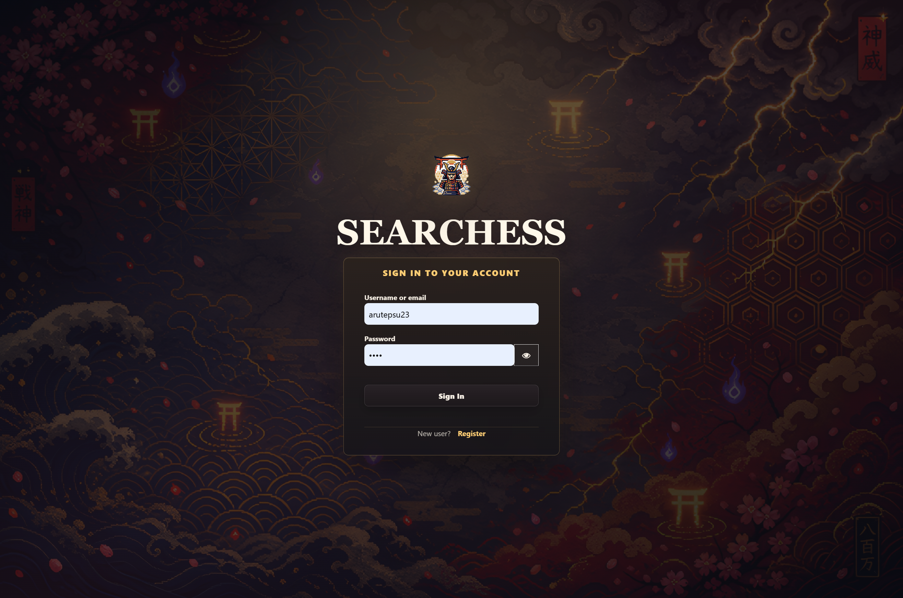 
  <em>Login screen</em>
</td>
<td align="center">
  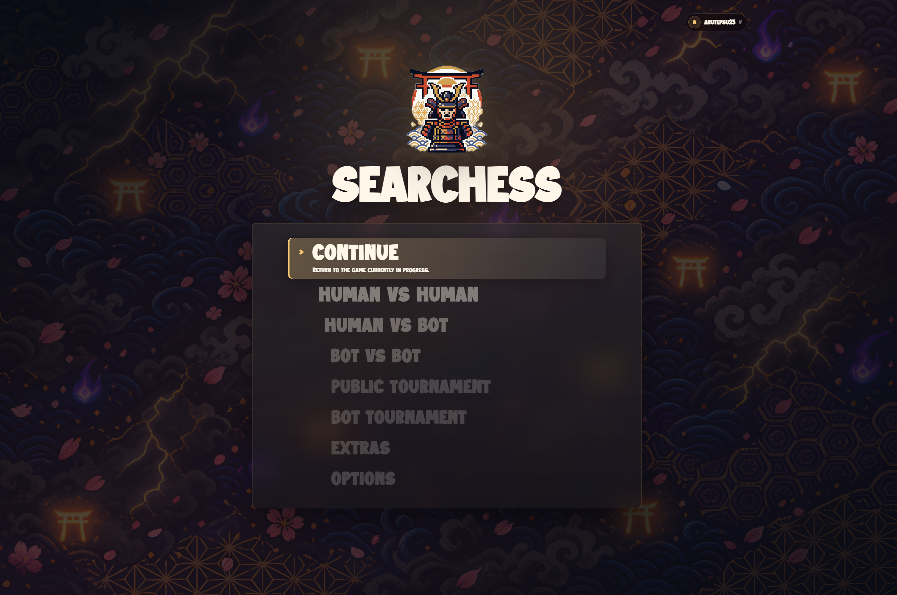 
  <em>Main menu</em>
</td>
</tr>
</table>

---

## 2. ⚔️ Game Experience

Searchess does not use a standard chessboard. The board is displayed **horizontally** — more like
a battlefield than a classic chess grid. This layout was chosen intentionally: the animated warrior
pieces are wider than tall, and they need visual breathing room for their idle, move, attack, and
death animations to read clearly. The result is a **cinematic, fantasy-style chess experience**
inspired by Japanese aesthetics.

   
  <em>Demo — a game in action.</em>

Players choose from six board and background themes, each with a distinct look and feel.

  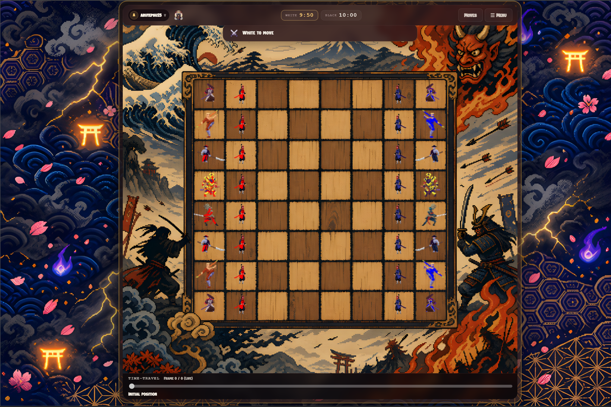 
  <em>Oni — a dark, fierce theme with demonic warrior aesthetics.</em>

  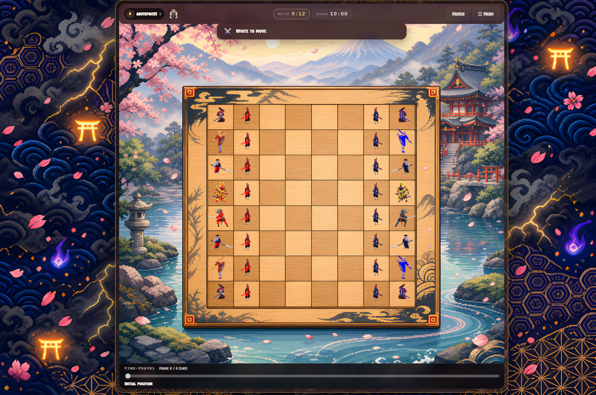 
  <em>Sakura — a delicate, pink-blossom theme evoking classic Japanese spring.</em>

  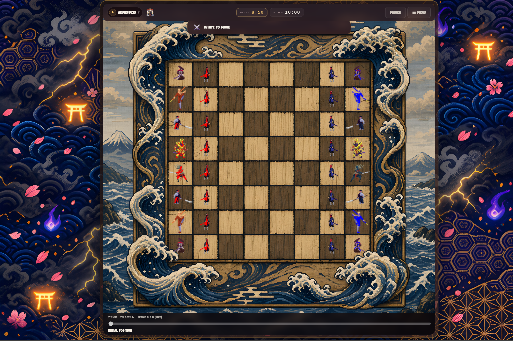 
  <em>Ocean — a cool, deep-blue theme with a flowing, aquatic atmosphere.</em>

  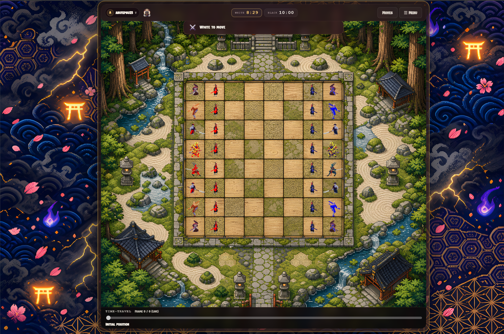 
  <em>Shrine — a red and gold theme inspired by traditional Japanese torii gates.</em>

  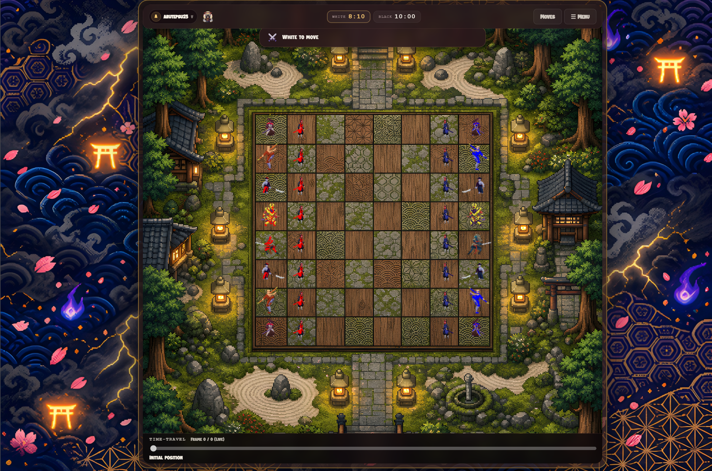 
  <em>Lantern — a warm, glowing theme lit by paper lanterns and candlelight.</em>

  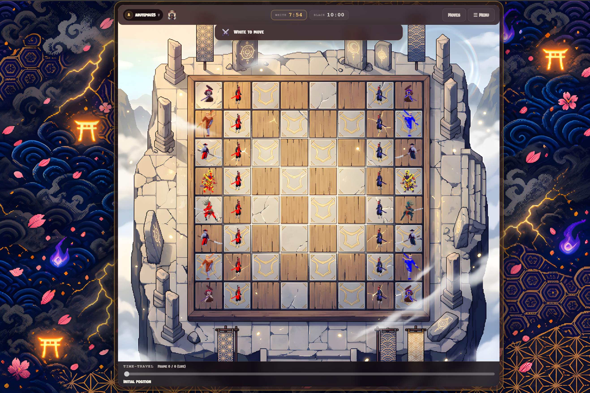 
  <em>Heaven — a bright, ethereal theme set high above the clouds.</em>

---

## 3. ⏸️ Pause Menu, Board Customization, and Import/Export

During a game, the pause menu lets users switch the board style and background on the fly without
leaving the game. Games can be saved directly from the pause screen.

  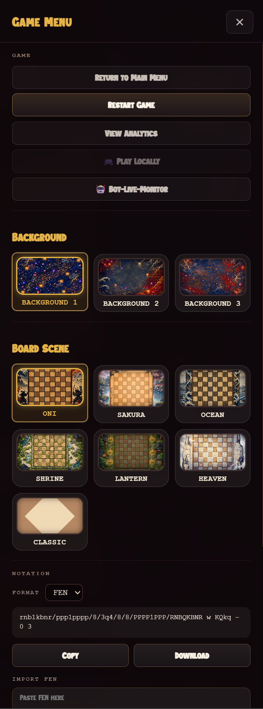 
  <em>The pause menu — change themes, save the game, or return to the main menu.</em>

Searchess also supports standard chess notation for exchanging positions and games:

- **FEN** (Forsyth-Edwards Notation) — encodes the current board position as a compact string,
  useful for jumping to a specific state or sharing a puzzle
- **PGN** (Portable Game Notation) — records the full move sequence of a game, compatible with
  any standard chess tool for replaying, analyzing, or continuing games elsewhere

  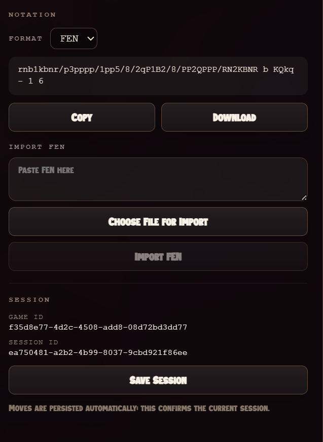 
  <em>Export and import — use FEN or PGN to save, share, replay, or continue any game.</em>

---

## 4. 🥷 Animated Warrior Pieces

Instead of traditional chess piece silhouettes, Searchess uses hand-crafted **pixel-art warrior
sprites** drawn in a Japanese fantasy style. Each piece is presented inside a decorative frame
that identifies its rank and allegiance.

Every piece has a full set of animation states:

| State | When it plays |
|---|---|
| **Idle** | Piece is on the board, waiting |
| **Run / Move** | Piece is moving to a new square |
| **Attack** | Piece captures an opponent |
| **Hit** | Piece is being captured |
| **Dead** | Piece leaves the board |

Animations work by cycling through sprite sheet frames at a configured frequency, making the board
feel alive rather than static. The horizontal board layout gives these wide, detailed sprites
enough space to animate without crowding each other — it is also what makes games feel more
cinematic than a standard vertical chessboard.

  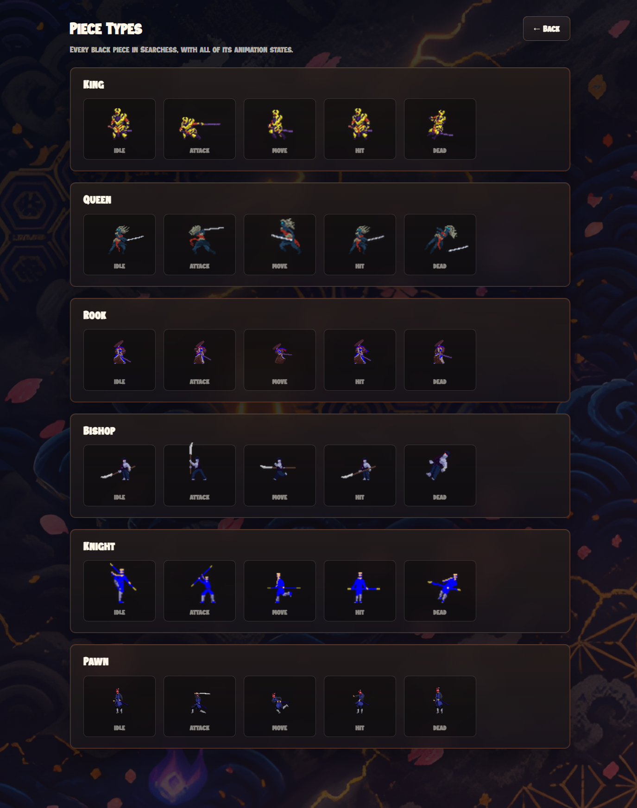 
  <em>The full cast of warrior pieces, each with its own animated frame set.</em>

> **Piece credits:** Warrior sprite assets by **LuizMelo**, sourced from
> [GameDevMarket](https://www.gamedevmarket.net/).

---

## 5. 🤖 Local Bot Tournaments

Local bot tournaments pit Searchess bots against each other in a structured competition without
any human players. You configure the tournament — choosing the tournament type, which bots
participate, how many repetitions to run, and other settings — then let the bots play automatically.

  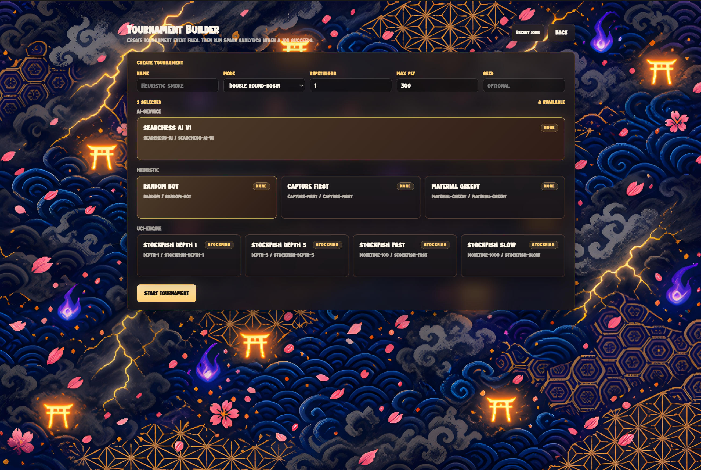 
  <em>Tournament configuration — select bots, set the type and repetitions, and start.</em>

Once the tournament finishes, all completed games are saved and can be reviewed individually. This
is the primary way to compare different bot strategies, calibrate difficulty levels, and evaluate
how the Searchess AI performs across different configurations.

  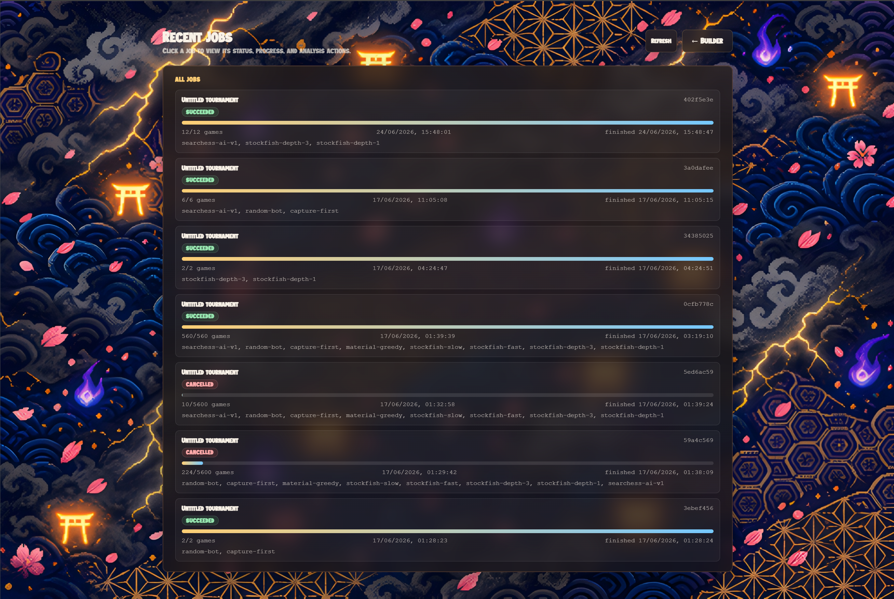 
  <em>Completed games — browse results and replay any game from the tournament.</em>

---

## 6. 📊 Local Tournament Analytics

After a local bot tournament completes, you can trigger analytics processing. Spark reads the
tournament's event log and computes a full set of statistics displayed in the Web UI as interactive
charts and tables.

Analytics include:

- **Leaderboard** — ranking by score, with wins, draws, and losses
- **Win rate** per bot
- **Elo ratings** — dynamic ratings calculated across all games in order
- **Head-to-head results** — how each bot pairing ended
- **Average game length** — by pairing
- **Termination reasons** — checkmate, stalemate, move limit, and others
- **Color performance** — how each bot performs as White vs Black
- **Bot family and strategy comparisons**

  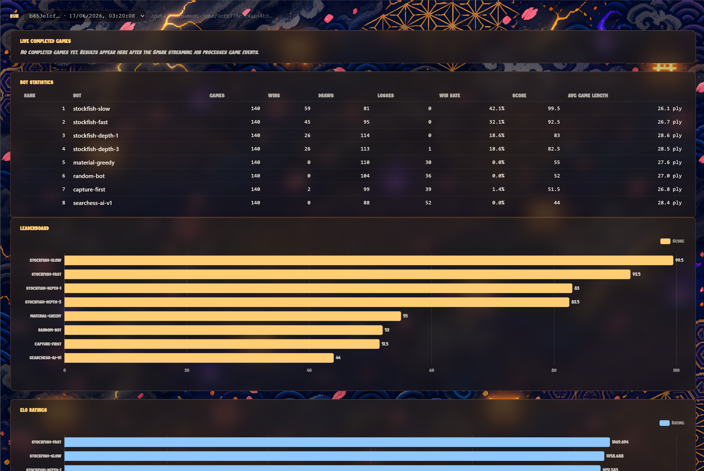 
  <em>Analytics overview — leaderboard, scores, win rates, and summary statistics.</em>

  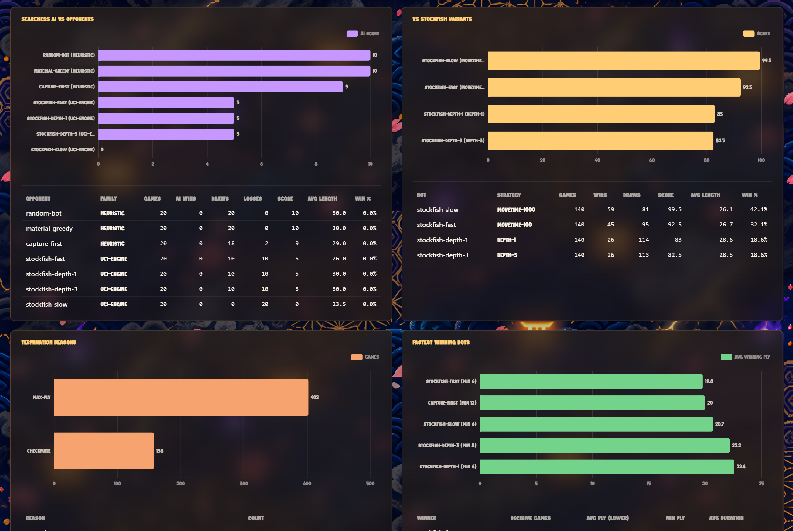 
  <em>Detailed statistics — Elo ratings, head-to-head results, termination breakdown, and more.</em>

---

## 7. 🌐 Public Bot Tournaments

As part of the university Software Architecture course, every student team built their own chess
project. Searchess includes a **Public Bot Tournament** feature that lets the Searchess bot compete
against bots from other teams through a shared tournament server.

The idea is similar to local bot tournaments, but the opponents are external — each running on a
different team's system. Users can join or create public tournaments depending on their permissions.

  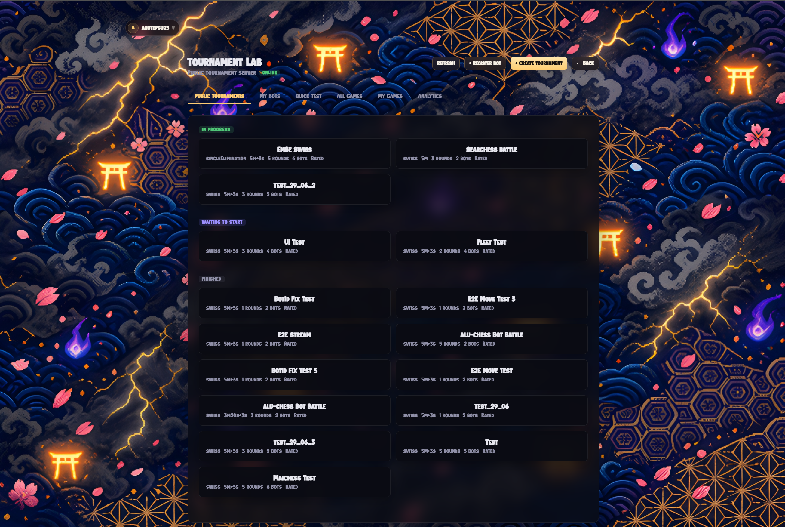 
  <em>Public tournament browser — see available tournaments and join or create one.</em>

While a tournament is running, the UI shows live bot moves as they happen so you can follow the
game in real time. Once a game finishes, it can be replayed in the UI.

   
  <em>Live game — watch bot moves happen in real time.</em>

  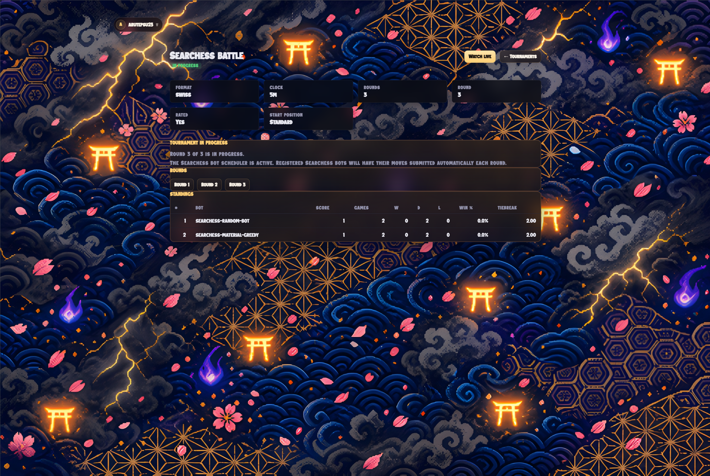 
  <em>Live tournament view — watch bot moves happen in real time during a running tournament.</em>

---

## 8. 📈 Public Tournament Analytics

Spark makes it possible to collect and analyze games from public tournaments as well, not only
local tournaments.

   
  <em>Analytics processing — turning public tournament game data into results.</em>

After a public tournament finishes, game data can be gathered, converted into the common event
format, and processed by the same Spark analytics pipeline used for local tournaments. This lets
you compare bots across teams using the same metrics.

The UI shows aggregated analytics for the whole tournament — standings, bot performance, game-level
results, and more.

  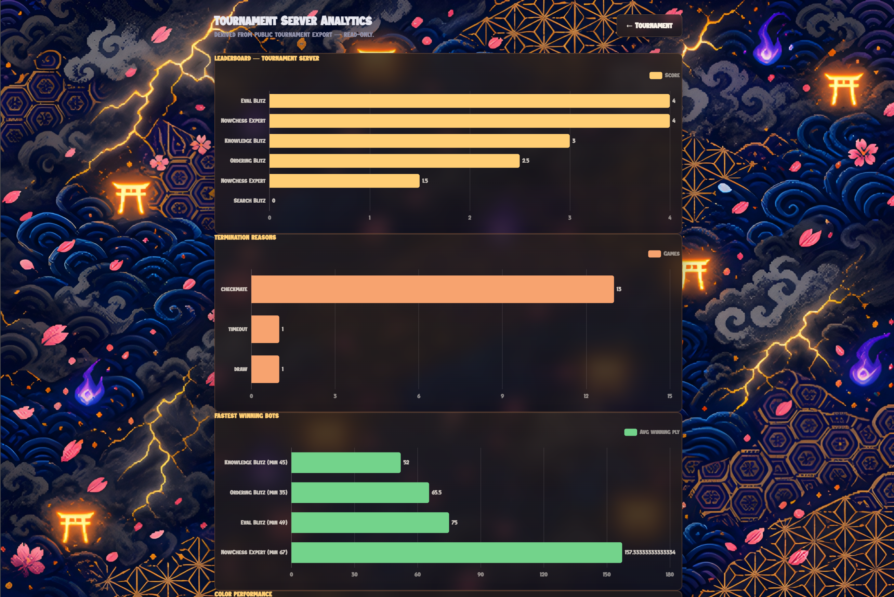 
  <em>Public tournament analytics — overall standings and summary statistics.</em>

  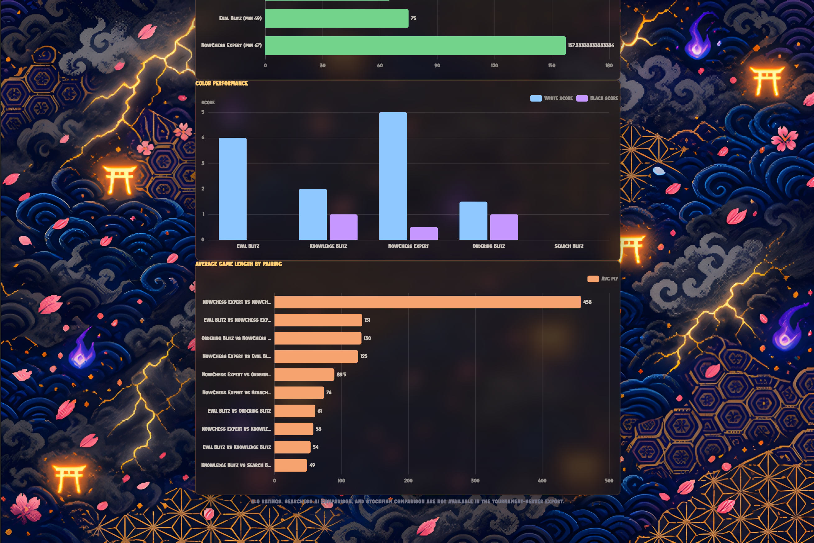 
  <em>Detailed analytics — per-bot statistics and performance comparisons across the tournament.</em>

  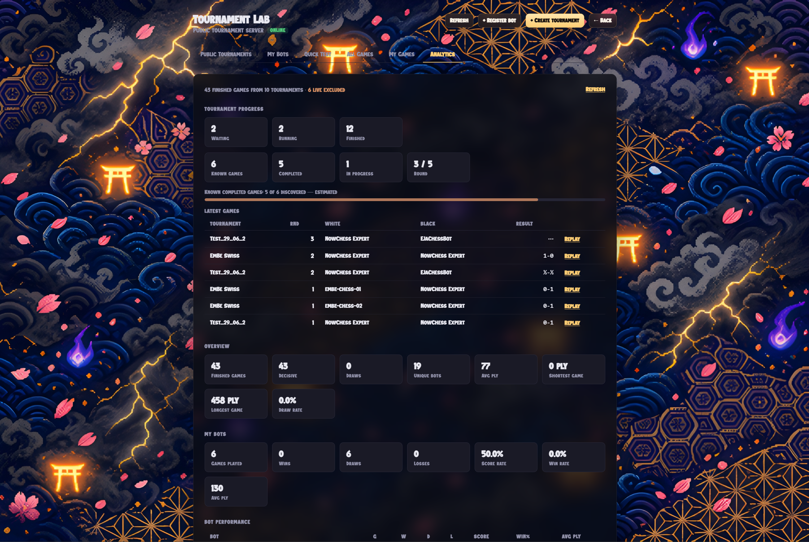 
  <em>Full analytics page — a broader view of all available tournament statistics.</em>

  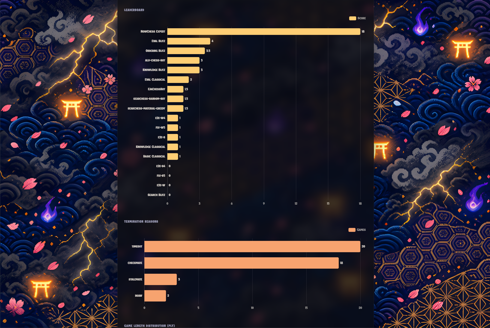 
  <em>Extended analytics — additional charts covering game patterns and bot behavior.</em>

  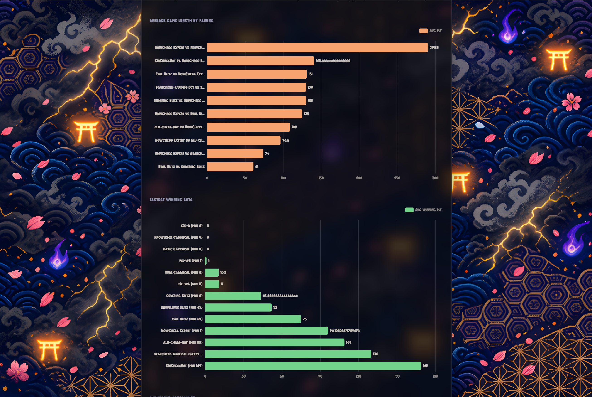 
  <em>Complete analytics — the full set of computed metrics for a public tournament run.</em>

---

## 9. 👤 Profile, Lichess Integration, and Game History

The profile section lets users manage their account details and link an external Lichess account.
Linking Lichess enables the bridge integration — the connected bot account can accept and play
games on Lichess.org with moves handled by the Searchess AI.

  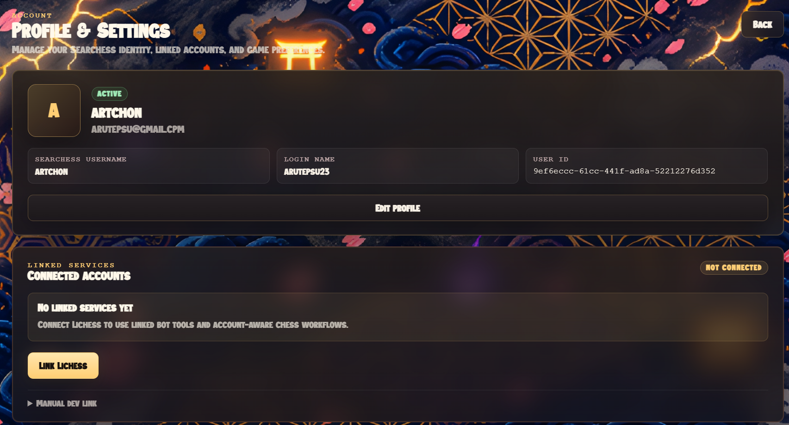 
  <em>Profile page — account settings and Lichess account linking.</em>

The UI can also display move history and game-level visualizations such as heatmaps, helping
players and developers review past games and understand patterns in play.

  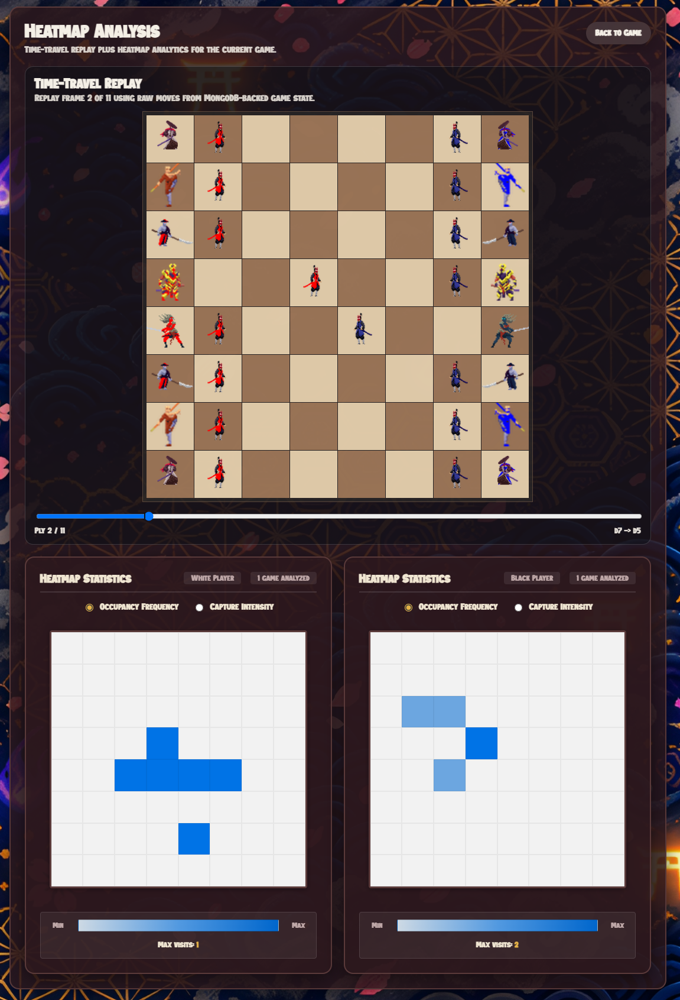 
  <em>Game history and additional platform features — move review, visualizations, and more.</em>

---

## 10. Summary

Searchess is not only a chess engine. It combines a custom animated chess UI, local and public bot
tournaments, Spark-powered analytics, profile management, Lichess integration, and a shared
tournament server for cross-team competition — all accessible from a single browser-based platform.
