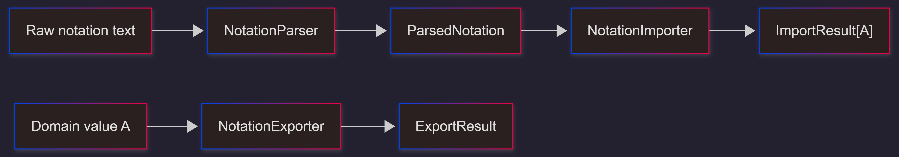
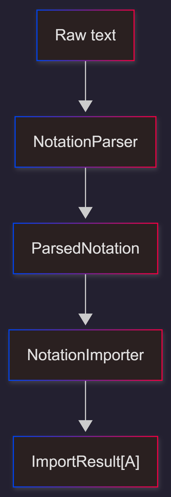
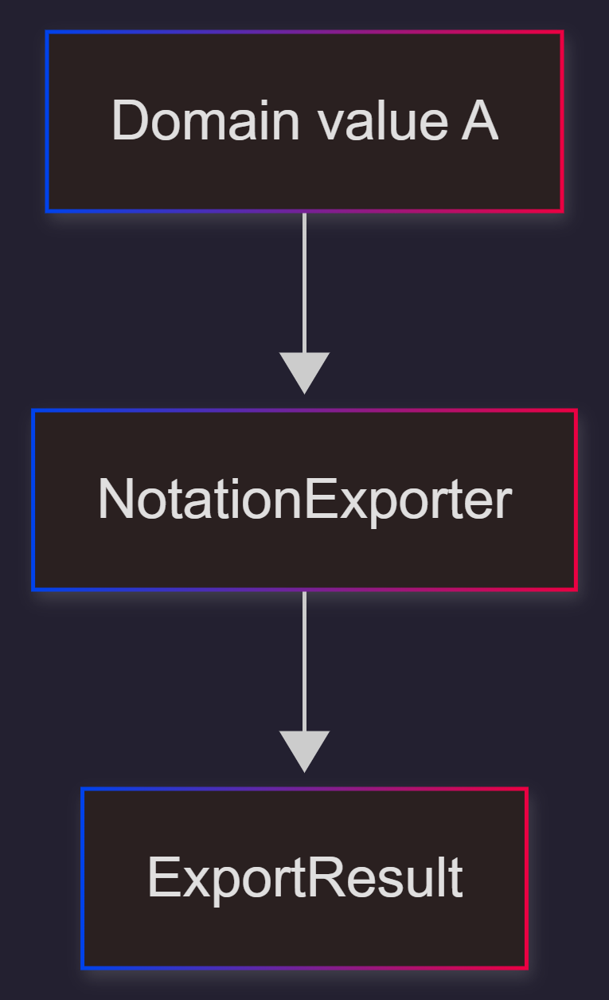
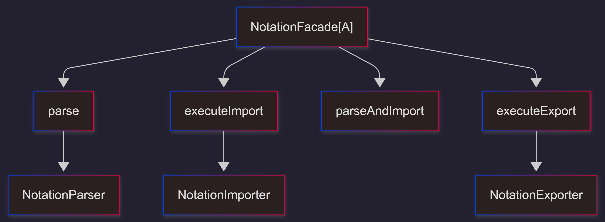
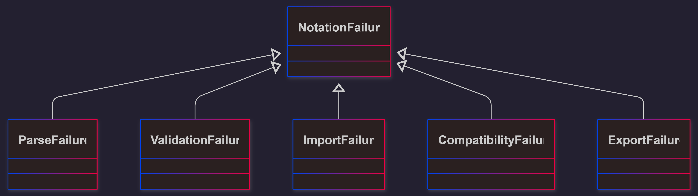
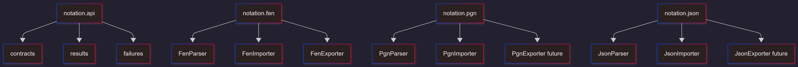

# Notation Architecture

## 1. Purpose

The notation subsystem provides a clean boundary between:

- external representations such as FEN, PGN, JSON
- internal domain state such as `GameState`

It supports two distinct directions:

- **Import**: text → domain
- **Export**: domain → text

---

## 2. Core Design Principle

Parsing, importing, and exporting are separate concerns.

### Import / Export overview

---

## 3. Contracts Overview

| Contract            | Input                           | Output               | Responsibility        |  
| :-----------------: | :-----------------------------: | :-----------------:  | :------------------:  |
| NotationParser	  |  raw text                       | ParsedNotation       | syntax and structure  |
| NotationImporter[A] |  ParsedNotation + ImportTarget  | ImportResult[A]      | semantics and mapping |
| NotationExporter[A] |  domain value + NotationFormat  | ExportResult         | serialization         |
| NotationFacade[A]   |  all of the above               | unified notation API | orchestration         |

---

## 4. Import Flow

#### Explanation
### 1. Parser
* converts raw text into structured notation IR
* handles syntax and structure only
### 2. ParsedNotation
* intermediate representation
* not a domain object
### 3. Importer
* validates semantics
* maps notation IR into domain state
### 4. ImportResult
* wraps successful imported value
* includes metadata and warnings

## 5. Export Flow

#### Explanation
### 1. Exporter
* takes a domain-side value
* serializes it to the requested notation format
### 2. ExportResult
* contains notation text
* includes format and warnings

## 6. ParsedNotation (IR Layer)
### Purpose

* ParsedNotation represents structured notation before domain mapping.

### Rules

Allowed: 

* parsed notation fields
* raw source text
* format-specific structured data

Not allowed: 

* domain GameState
* business logic
* UI state
* side effects

### Variants

## 7. Import/Export Results

### Import Meaning

A successful import result contains:

* the imported domain value
* the source format
* structured metadata
* structured warnings
### Import Rule

The subtype already encodes the target intent:

* PositionImportResult implies PositionTarget
* GameImportResult implies GameTarget

### Export Meaning

ExportResult is structured on purpose.

It is not just a raw string because callers may need:

* the exported text
* the target format
* warnings about lossy or incomplete export

## 8. NotationFacade
### Role

NotationFacade[A] is the unified entry point for:

* parsing
* importing
* exporting

### Diagram

### Key Rules

* The façade orchestrates.
* It should not become the place where format-specific logic accumulates.

## 10. Failure Model
### Hierarchy

### Failure-to-phase mapping:

| Error Type             | Phase(s)                 |
|------------------------|--------------------------|
| ParseFailure           | parsing                  |
| ValidationFailure      | import                   |
| ImportFailure          | import                   |
| CompatibilityFailure   | parse / import / export  |
| ExportFailure          | export                   |

## 11. Module Structure

